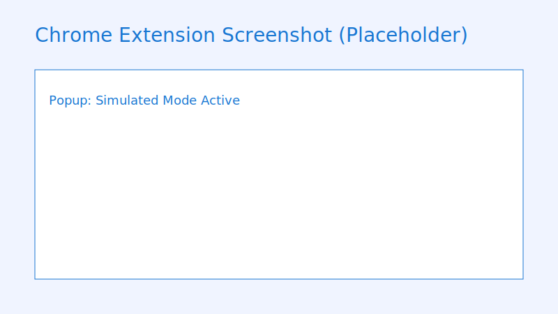
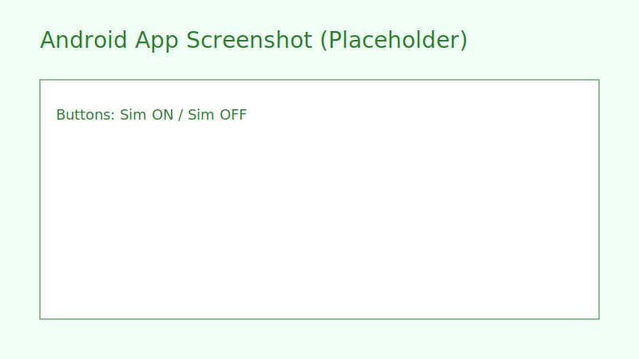

# SimulatedPlayback

SimulatedPlayback — When users turn off the screen or mute their device, this system stops actual decoding and data fetching while continuously advancing playback progress. It saves battery and data without breaking user experience.

关闭屏幕或静音时，本系统暂停实际媒体解码与数据请求，但持续推进播放进度，从而节省电量与流量，同时保持播放体验的一致性。

Traditional players keep decoding and buffering even when the screen is off, wasting battery and bandwidth.  
SimulatedPlayback provides an **intelligent simulated progress mode** that stops unnecessary processing while keeping playback continuity.

传统播放器在关闭屏幕后仍持续解码与缓冲，造成电量与流量浪费。  
SimulatedPlayback 提供一种智能“虚拟播放”模式：停止无意义的资源消耗，但保持进度同步。

## Components / 组件
- tampermonkey/: MVP userscript
- web-extension/: Chrome/Firefox extension
- android/: Kotlin SDK + sample
- docs/: Proposal, benchmarks, site

## Screenshots / 截图

## Comparison / 对比
| Metric | Real Playback | Simulated Playback |
|---|---:|---:|
| Battery | Higher drain | Lower drain |
| Data | Media fetched | Minimal/no media |
| CPU | Decoder active | Lightweight timer |

## Quick Start (Chrome)
- Open `chrome://extensions`, enable Developer Mode
- Load unpacked folder `web-extension/`
- Open YouTube/Bilibili → use popup toggle to enable Simulated Mode

## 快速开始（Chrome）
- 打开 `chrome://extensions`，启用开发者模式
- 选择“加载已解压的扩展程序”，选择 `web-extension/`
- 打开 YouTube/Bilibili → 在弹窗中开启模拟模式

## Quick Start (Android)
- Open `android/` in Android Studio
- Build and run `sample-app`
- Use Sim ON/OFF buttons to switch between modes

## 快速开始（Android）
- 在 Android Studio 打开 `android/`
- 构建并运行 `sample-app`
- 使用 Sim ON/OFF 按钮切换模式

## License / 许可
Apache-2.0. See `LICENSE`.

## Contributing / 贡献
- Issues and PRs welcome
- 参见 `CONTRIBUTING.md`

## Contact / 联系
- Maintainer: Your Name
- GitHub: https://github.com/yourname/simplay
